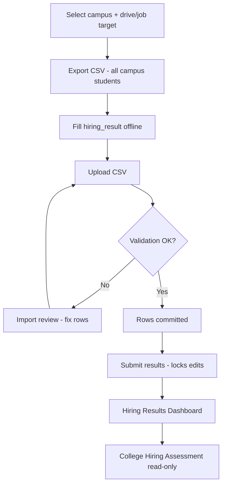
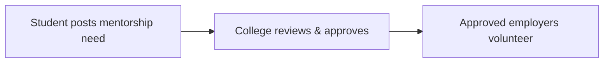

# PlacementHub — Functionality, Features & Flows

**Version:** June 2026 (sandbox / pre-launch)  
**Audience:** Product, engineering, QA, college TPOs, and employer partners  
**Scope:** What the platform does, how roles interact, and the main end-to-end journeys  
**Word export:** [`placementhub-functionality.docx`](placementhub-functionality.docx) — diagrams embedded as PNG (regenerate: `python scripts/md_to_docx.py`; refresh diagrams: `python scripts/md_to_docx.py --force-diagrams`)

---

## 1. What PlacementHub is

PlacementHub is a **multi-tenant campus placement and engagement platform**. It connects three primary audiences on one system:

| Audience | Primary job on the platform |
|----------|-----------------------------|
| **Students** | Discover opportunities, apply, attend interviews, respond to offers |
| **College admins (TPO / placement office)** | Run the placement season, approve employers, enforce rules, coordinate selection |
| **Employers** | Partner with campuses, publish roles and drives, run hiring, record offers |

A **super admin** layer operates the whole platform: onboarding colleges and employers, user support, global settings, and audit visibility.

Beyond core placement, the product supports **internships, short projects, hackathons, alumni hiring, sponsorships, startup seed funding, guest faculty, student mentorship requests, and campus calendars** — so industry engagement and final placements live in one place rather than scattered spreadsheets and email threads.

---

## 2. Multi-tenant model

Every college is a **tenant**. Data is scoped by tenant:

- Students belong to one college tenant.
- Employers are **cross-tenant**: one company account can request tie-ups with many colleges.
- **Employer–campus partnerships** (`employer_approvals`) gate what an employer can see or do for each institute (pending → approved → rejected).
- **Academic years** and **placement season** labels separate batches and reporting across years.

Employers work across **all approved campuses** (campus switcher is disabled; the top bar shows “All campuses”). Per-screen campus dropdowns still exist where a specific campus context is required (assessments, interviews, some exports).

---

## 3. Roles and access

| Role | Signs up via | Home after login |
|------|----------------|------------------|
| **Student** | **Not self-service** — college provisions the master list; student receives login email | Student dashboard |
| **Employer** | `/register` (platform approval may apply) | Employer dashboard |
| **College admin** | `/register` or super-admin onboarding | College dashboard |
| **Super admin** | Provisioned by platform ops | Admin dashboard |

**Alumni students** are flagged on the student account; they see alumni job browse/apply menus instead of campus placement drives.

Navigation is **role-based** (sidebar + full-screen hub). Alerts, data export, and feedback are shared across roles where enabled.

---

## 4. Opportunity types (programs)

PlacementHub treats each program type as a first-class pipeline with its own browse, apply, and application tabs.

| Type | Typical use | Who publishes | College gate |
|------|-------------|---------------|--------------|
| **Placement drives** | On-campus / virtual hiring events linked to roles | Employer requests; college approves | Drive visibility + employer partnership |
| **Jobs** | Full-time, part-time, PPO | Employer publishes to selected campuses | College approves listing visibility per campus |
| **Internships** | Summer / semester internships | Employer | College approves visibility |
| **Short projects** | Portfolio / exposure work | Employer | College approves visibility |
| **Hackathons** | Competitions (optional PPO link) | Employer | College approves visibility |
| **Alumni jobs** | Lateral roles for graduated alumni | Employer | Published to alumni on campus |

**Informal engagement (lightweight, not a hiring pipeline):**

| Type | Typical use | Who initiates | College gate |
|------|-------------|---------------|--------------|
| **Mentorship requests** | Career guidance, domain mentoring, résumé/industry exposure | **Student** posts need | College **approves** before employers see it; employers **volunteer** (no apply/offer pipeline) |

Students apply from **Browse** screens for formal programs; status is tracked under **My Applications** (separate tabs per type). **Mentorship requests** are tracked separately — interest-based matching, not selection or offers. Employers manage listings under **Student Opportunities**; colleges monitor **Applications** and program boards.

---

## 5. Features by role

### 5.1 Student

| Area | Capabilities |
|------|----------------|
| **Profile & documents** | Academic details, skills, resume and proofs; profile completion guidance |
| **Discovery** | Browse drives, jobs, internships, projects, hackathons; placement calendar |
| **Applications** | Apply before deadlines; track status (applied → shortlisted → in progress → selected, etc.) |
| **Selection** | My Interviews; view hiring outcomes where exposed |
| **Offers** | Review and accept/decline per college rules |
| **Communication** | Clarifications (official Q&A batches); alerts; feedback |
| **Mentorship** | Post informal mentorship needs (topic, goals, availability); track college approval and employer volunteers |
| **Compliance** | Eligibility checks (CGPA, backlogs, batch year, deadlines); withdrawal flows |
| **Privacy** | My data export (where supported) |

### 5.2 Employer

| Area | Capabilities |
|------|----------------|
| **Organization** | Company profile, sponsorships, startup seed funding, campus guest needs |
| **Partnerships** | Request campus tie-ups; track approved / pending / rejected |
| **Publishing** | Internships, placement drives, projects (and jobs via dedicated flows) |
| **Recruitment & selection** | Hiring Results Dashboard (read); Assessment uploads (CSV); Assessment Update Online (write); Assessment map (round labels, legacy) |
| **Pipeline** | Applications; FCFS “unavailable” list; offers (including CSV upload from Offers page) |
| **Operations** | Interview scheduling; events calendar |
| **Communication** | Clarifications, discussions, email templates, feedback |
| **Engagement** | Campus guest needs (respond to college listings); **mentorship requests** (volunteer on approved student posts) |

### 5.3 College admin (TPO)

| Area | Capabilities |
|------|----------------|
| **Partnerships** | Approve/reject employer requests; employer directory |
| **Programs** | Placement drives board; internships; internship results |
| **Students** | Master list, verification, add student, enrollment key |
| **Pipeline** | Campus applications board; offers |
| **Evaluation** | Hiring Assessment (read-only mirror of employer results); interview scheduling |
| **Rules** | Placement rules (CGPA, offer limits, season dates, FCFS, etc.) |
| **Engagement** | Calendar, events, guest faculty & lectures, sponsorships, startup funding |
| **Insights** | Reports, audit reports |
| **Communication** | Clarifications (publish batches), discussions, templates, feedback |
| **Mentorship requests** | Review & approve student posts; moderate visibility to partnered employers |

### 5.4 Super admin

| Area | Capabilities |
|------|----------------|
| **Directory** | Colleges, employers, users, placement listings, archived students |
| **Onboarding** | Pending registrations (college + employer approval queue) |
| **Operations** | Feedback inbox, error logs, email logs, audit reports |
| **Configuration** | Platform settings (SMTP, branding URLs, feature-related globals) |

---

## 6. End-to-end flows

### 6.1 One placement season (all roles)

```mermaid
flowchart LR
  SA[Super admin onboards college & employer]
  CA[College approves employer partnership]
  EM[Employer publishes drive / job]
  CA2[College approves listing visibility]
  ST[Students apply]
  EM2[Employer records assessments & interviews]
  EM3[Employer records offers]
  CA3[College rules enforce limits]
  RPT[Reports & audit]

  SA --> CA --> EM --> CA2 --> ST --> EM2 --> EM3 --> CA3 --> RPT
```

**Narrative:** Platform enables a college and employer → TPO approves the partnership → employer publishes opportunities → college curates visibility → students apply → employer runs selection (CSV/online assessments, interviews) → offers are recorded → college placement rules (e.g. one FT offer, FCFS) apply → leadership closes the season with reports.

Deployments may skip steps (auto-approved employers) or add steps (extra assessments). Role-specific sections below are the day-to-day source of truth.

### 6.2 Student journey

1. **Provisioned** by college (CSV / add student) — receives login email (no self-registration on `/register`).
2. **Sign in**, complete **My Profile** and **Documents**.
3. **Browse** drives, internships, jobs, projects, or hackathons; use **Placement calendar** for dates.
4. **Apply** before each deadline; eligibility enforced (CGPA, backlogs, batch, deadline; branch matching is display-only until taxonomy ships).
5. Track **My Applications**; respond to **My Interviews** and **Alerts**.
6. Read **Clarifications** from the placement committee.
7. Act on **My Offers** per institute policy.

### 6.3 Employer journey

1. **Register** (or be onboarded by super admin); complete **Company Profile**.
2. **Campus Partnerships** — request tie-ups; wait for college **approved** status.
3. **Publish** internships, drives, projects; select campuses where posting constraints allow.
4. **College approves** job/internship visibility per campus where required.
5. **Recruitment & selection:**
   - Enter results via **Assessment uploads (CSV)** or **Assessment Update Online** (`hiring_result`: Shortlist, Reject, Select, Decline, Withdraw).
   - Review on **Hiring Results Dashboard**; **Submit results** when final.
   - Schedule interviews; review **Applications**.
6. Record **Offers** (UI or CSV from Offers page).
7. Participate in **Clarifications** / **Discussions** when the college publishes threads.

### 6.4 College admin journey

1. Configure **Settings** (season label, policies exposed in product).
2. **Approve employer partnerships** before companies run on campus.
3. Manage **Students** — verify profiles; rotate **Enrollment key** if needed (legacy flows; students are primarily provisioned directly).
4. Curate **Placement drives** / **Internships** visibility.
5. Monitor **Applications** and **Offers**; mirror employer **Hiring Assessment** (read-only).
6. Coordinate **Interview Scheduling** with employers.
7. Publish **Clarifications**; moderate **Discussions**.
8. Enforce **Placement Rules**; export **Reports** / **Audit reports**.

### 6.5 Assessment CSV workflow (employer)

**Alternative:** **Assessment Update Online** — same data model, inline edits, no file.

Assessment updates are **dashboard-visible**; they do not email students by default.

### 6.6 Student mentorship requests (informal)

Lightweight career mentoring — **not** a placement drive, application pipeline, or offer workflow.

**Narrative:**

1. **Student** describes what they want (e.g. industry, skills, goals, preferred format, optional time window). No employer listing required.
2. **College** approves, edits, or rejects — keeps posts appropriate and on-brand for the institute.
3. Once approved, **partnered employers** see open requests and **volunteer** (express interest / offer to mentor). Matching is informal: email or in-app handoff, not Select/Offer states.
4. No CGPA/offer-lock side effects unless college configures optional rules later.

**Contrast with formal “mentorship” job postings:** Employers may still publish structured mentorship programs under **Student Opportunities** (apply → track like internships). Student-initiated requests are the inverse: demand-led, college-moderated, volunteer-based.

---

## 7. Key subsystems

### 7.1 Employer–campus partnerships

- Employer requests access from **Campus Partnerships**.
- College approves via **Employer Partnership Requests**.
- Until approved, employer actions for that tenant are blocked or empty at the API layer (`employer_approvals`).
- Employers see a **directory of all colleges** (for requests), not only approved ones.

### 7.2 Job posting visibility

- Employer publishes a job/internship/project to selected campuses.
- Each campus has a **college_status** on visibility (pending / approved / rejected).
- Students only see **approved, published** listings for their tenant.

### 7.3 Placement drives

- Employer **requests** a drive with role details, dates, venue, eligibility.
- College **approves** the drive; students **register/apply**.
- Drive lifecycle includes scheduled, in progress, completed; venue warnings surface when date is near and venue unconfirmed.

### 7.4 FCFS (first-come-first-served)

When enabled in college settings, the **first employer to confirm** a student on a track (internship, placement, jobs) blocks other employers from selecting that student on the same track for that campus. **Unavailable (FCFS)** on the employer menu lists students already claimed.

### 7.5 Placement rules (college)

Configurable per tenant, including:

- Offer limits (e.g. max simultaneous offers)
- Minimum CGPA and backlog rules
- Placement season windows
- FCFS enablement
- Academic year scoping on drives and postings

Rules are enforced at apply time and offer time where implemented.

### 7.6 Communication

| Channel | Purpose |
|---------|---------|
| **Alerts** | In-app notifications (applications, approvals, reminders) |
| **Email** | Transactional mail (welcome, selection, password reset, etc.); super-admin **Email logs** |
| **Clarifications** | Official batched Q&A — college publishes questions/answers for employers |
| **Discussions** | Moderated threads where enabled |
| **Email / message templates** | Reusable copy for college and employer outreach |

### 7.7 Data export & audit

- **My data export** — role-scoped self-service downloads where supported.
- **Audit reports** — college and super-admin compliance views.
- CSV export on many tabular screens (applications, assessments, interviews, offers).

### 7.8 Help & feedback

- In-app **Help** widget — natural-language answers from indexed help docs (sync via `npm run qa:sync-help-knowledge`).
- **Feedback** — product feedback routed to admin inbox.
- **Developer Notes** (`/developer`) — QA runbooks, demo APIs, guided runner (password-gated).

---

## 8. Accounts and security (summary)

| Topic | Behavior |
|-------|----------|
| **Student onboarding** | College adds to master list; student signs in with issued credentials — **not** via public student registration |
| **Employer / college signup** | `/register` with captcha; may require super-admin approval before first login |
| **Sessions** | Role-based dashboard access; middleware protects routes |
| **Dev / QA surfaces** | `/developer`, `/data-entry` password-gated; screen ID pills for guided testing (hide in production via env) |
| **Multi-tenant isolation** | Tenant ID on student data; employer campus scope checked on sensitive APIs |

---

## 9. Engagement modules (beyond core placement)

| Module | Employer | College |
|--------|----------|---------|
| **Sponsorships** | Offer sponsorships | View / coordinate |
| **Startup seed funding** | Apply / track | Review campus startups |
| **Campus guest needs** | Respond to lecture needs | **Guest faculty & lectures** — list needs |
| **Mentorship requests** | Volunteer on approved student posts | Review & approve student mentorship needs |
| **Events & calendar** | Employer calendar | College calendar + events |

These share the same tenant and partnership model as hiring but do not replace the application/offer pipeline. **Mentorship requests** are the most informal: no assessments, interviews, or offers — only post → approve → volunteer.

---

## 10. Alumni

- Employers post **alumni jobs** (lateral roles).
- Alumni-flagged students browse **Alumni Jobs** instead of campus placement drives.
- Separate application tabs and interview flows where configured.
- **Alumni Job Assessment Online** on employer menu for alumni hiring updates.

---

## 11. Platform matrix (quick reference)

| Capability | Student | Employer | College | Super admin |
|------------|:-------:|:--------:|:-------:|:-----------:|
| Browse / apply to programs | ✓ | — | monitor | — |
| Publish drives & listings | — | ✓ | approve | listings admin |
| Assessment results entry | view | ✓ CSV/online | read-only | — |
| Interview scheduling | view | ✓ | ✓ | — |
| Offers | accept/decline | ✓ + CSV | monitor | — |
| Placement rules | subject to | — | configure | — |
| Partnership approval | — | request | approve | — |
| User / tenant admin | — | profile | students | ✓ |
| Audit / email logs | export self | export self | audit | ✓ |
| Mentorship requests | post | volunteer | approve | — |

---

## 12. Related documentation

| Document | Use when |
|----------|----------|
| [`docs/help/README.md`](../help/README.md) | Role-specific help markdown (synced from in-app help) |
| [`docs/help/use-case-flows/`](../help/use-case-flows/) | Step-by-step flows per role |
| [`PRODUCT.md`](../../PRODUCT.md) | Product purpose, users, brand tone |
| [`DESIGN.md`](../../DESIGN.md) | UI / design principles |
| [`/developer`](../../src/content/developerNotes.js) | QA playbooks, demo APIs, pending backlog |
| [`docs/help/developer/database-schema.md`](../help/developer/database-schema.md) | Tables and relationships |

---

## 13. Glossary

| Term | Meaning |
|------|---------|
| **TPO** | Training & Placement Officer; college admin role |
| **Tie-up / partnership** | Approved link between employer and college tenant |
| **hiring_result** | Employer assessment outcome: Shortlist, Reject, Select, Decline, Withdraw |
| **FCFS** | First-come-first-served locking of a student on a track per campus |
| **Tenant** | One college instance in the multi-tenant database |
| **Visibility row** | Per-campus approval state for a job posting |
| **Guided Runner** | QA automation that steps through screens using dev screen IDs |
| **Mentorship request** | Student-initiated informal ask for career mentoring; college approves; employers volunteer (not a hiring pipeline) |

---

*This document describes intended product behavior for the current sandbox build. Some help pages may still mention student self-registration with an enrollment key; production provisioning is college-driven. For the latest menu names, use the in-app sidebar or `src/config/dashboardMenu.js`.*
